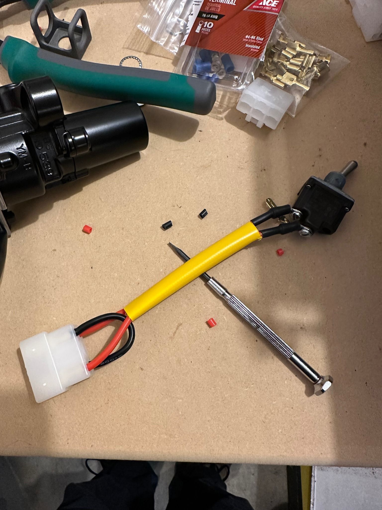

# Brakes
The base 2024 MT-09 uses the same Advics radial calipers that Yamaha has used for YEARS across various bikes, particularly the 3rd Generation R6. SP models get upgraded to Brembo Stylemas. Both bikes use the same 17mm Brembo radial master and are plumbed through an ABS system.

## Pads
### Advics Calipers
EBC specs out FA252 pads for the MT-09, and doesn't offer them in their racier compounds. EBC for the R6 specs out FA380 pads, and offers them in their GPFAX compound. The pads are the same backing plate and thickness, FA252s come with anti-rattle shims, FA380s don't. Forget the FA252s exist, shop around FA380 and matching pad fitments from other providers. I'm trying DP RDP418 'RDP X-Race Titanium' pads this year on my MT-09.

Plumbed through the stock lines and ABS module, the stock 17mm Brembo master feels OK, now that I've switched to direct lines from Core Moto I'm a little worried that I'll be slightly over-mastered. On the R6 Yamaha paired these calipers with a 16mm radial master, the Advics run a slightly smaller piston area than the Stylemas. I have a couple OEM R6 masters on standby if I don't like the feel of the Brembo.

### Brembo Stylema Calipers
Haven't chased pads on these. On paper these calipers should be about 100g lighter per side than the Advics?

## Rotors
298mm Yamaha R6 rotors (2nd generation R6) are direct bolt ups. My Goldfrens I used to use on my superbike FZR400 with an R6 front wheel for example are the right OD, and are 3oz lighter per side than the OEM Yamaha units.

## Other Goodies
[L74](https://www.l74.co.uk/product/yamaha-mt09-2021-onwards-caliper-bundle/) has underslung caliper setups for the MT-09, they may be able to adapt an R6 quick change axle to work with the MT's setup if asked?

# Wheels
3rd Gen (2021 to 2023) and 4th Gen (2024+) MT-09 sport 'spin forged' wheels that Yamaha claims are lighter than the older cast units seen on the R6. Interestingly... for the R9 they went back to the older style cast wheels, telling the press that despite being heavier riders preferred the feel of the. First time I got tires mounted at the track, they told me I needed to find lighter wheels and had me pick up an R6 front for comparison... in race setup that R6 wheel was noticably lighter. I've not had a chance to compare weights directly with scales, possible that R6 wheel was rocking full Ti hardware, ceramic bearings, etc... but I don't think so? R6 wheels aren't a direct swap, up front they'll bolt up but lack provisions for the ABS tone ring. In back it looks like the MT-09 is using a different sprocket carrier, not sure if it'll swap to an R6 wheel or not, and again, no provisions for the ABS tone ring.

As of spring 2025 Dymag has fitments available for their UPX7 wheels, I'll compare weights on those when I get a set.

## Captive Spacers
The MT-09 wheels come with nice, light, simple wheel spacers that are the opposite of captive, they like to eject themselves the moment you attempt to put a wheel back on the bike.

### Front Wheel
Pretend the bike is a 3rd generation R6, source captive spacers for one. I prefer ones like Graves or Spider Racing out of Italy that have large bevels on the outside faces to ease reinstalling the wheel.

### Rear Wheel
The rear wheel has an oddball spacer on one side that doesn't cross to any earlier Yamahas, as such there aren't as many options for captive spacers that will fit the MT-09, but Spider Racing out of Italy does list a kit that can be ordered through HSBK in the US.

# Ditching Keys
Standard race prep is to get rid of anything needing a key so you don't have to worry about that on track. Unfortunately, given how few of these bikes are raced most of those parts haven't been adapted to the MT-09 yet.

## Tank
Everywhere lists the 2024+ MT-09 as working with the same keyless gas cap assemblies as the 21-23 MT-09, R6 forever, etc. This is not the case, the bolt circle is larger, and the actual tank opening is at the bottom of the bolt circle instead of the top as is normally the case on Yamahas. No keyless cap exists for these tanks yet.

Update! There is at least one keyless cap now in preproduction testing - [TENAGAFRASER](https://shop.tenagafraser.com/products/berani-fuel-cap-for-yamaha-mt-09)

## Seat
[S2 Concept](https://www.s2-concept.com/en/) out of France makes a race tail for these bikes that will let you toss the OEM seats (5lbs?!) and some of the heavy steel subframe bracketry to retain them. I've not done this upgrade yet myself. They also have a belly pan and some other suitable bits too.

## Ignition
Yamaha seems to be using the 2024 MT-09 to try out all sorts of new parts that don't cross to anything else. The ignition switch is one such item, unique to the 24+ MT-09 using a different connector than they ever used. No keyswitch elimination kit exists yet. It looks like the R9 uses the same connector and wiring.

The switch uses a 6 pin, .250in wide contact connector that appears to be a 'Sumitomo' design last seen on old Kawi regulator rectifier connections. The keyswitch is a double pole single throw unit, no parking light position. The switch jumps two circuits, one is basically an ECU 'go' trigger, the other is the main 12v feed from the batt to the rest of the harness, no relays or anything to lower the current running through the switch. SP bikes have a keyless main switch already but expect you to carry the fob on you...

When you look at the connector, there are four wires, two thin wires, two thick wires, one of each on each side of the connector. The thin wires are the ECU 'go' signal, thick are the power feed. Looking at the keyswitch side connector, looking into it with the locking tab facing up, the wires are:

| | locking tab | |
| --- | --- | --- |
| Blue with Black stripe | | Red |
| Orange with Blue stripe | | Blue |

Get the service manual to see the wiring diagrams for the ignition system.

### Kurlon Bypass
Remove the OEM ignition switch, this is not fun. You'll need to remove the tank and airbox, both well documented online. Then, to get the switch tower off you'll need to deal with it's four bolts. These have been installed using red or equivalent PITA loctite. I was able to remove the upper two bolts using a 6mm allen impact bit, the two lower bolts are security bolts that sheer off the heads when installed. I ended up grinding the remaining heads off, which allowed me to remove the tower and frame strengthening steel plate underneath. From there I had to use locking pliers to work the bolt stubs out. In hind sight, a torch to heat the bolts/frame up and defeat the loctite would have made things easier but I wasn't comfortable waving a torch around under there at that time.

Souce a matching connector, [Cycleterminal](https://www.cycleterminal.com/250-connectors.html) lists a Sumitomo .250 non-sealed locking connector that sounds like a match, it's locking tabs are on the wrong connector though. The harness side female connector has the lock prong, the male connector for the switch end should have a slot to recieve it, and Cycleterminal's unit flips those around. The crimp connectors they supply for it though do appear to be a close match. On the same page they list "Yazaki CN-A Locking Type - 250 Connectors" which are keyed correctly and are what I'm using on my bike now. If you google "sumitomo lock type 0.250 6 pin" you'll find other listings for what appear to be matching connectors, some of which come with wire leads already crimped up if you don't like crimping your own terminals.

On the new connector, wire a jumper between the Blue with Black stripe wire position and Blue wire position. This is just an ECU 'go' signal, if the switch had a park position, leaving this pair open but jumping the 12v feed would be how it would achieve that. There is no power on this loop when the 12v feed isn't connected so it won't cause a drain on the bike staying in place.

Crimp in leads to the Red and Orange with Blue stripe positions, these are what will be switched on and off to control power to the bike. These lines carry a decent amount of current, I used 14ga fine strand wire with silicone insulation, so VERY flexible, very heat resistant and also more current capacity than typical automotive coarse strand wire.

Source a suitable SPST waterproof switch, knowing it's going to see 12v DC and potentially 10A+ at times. Speedcell offers a generic 'master arm switch' kit with a suitable switch and nice 3d metal printed guard.

# ECU
There are more opinions about tuning ECUs than there are about what oil to run. Piggyback tuner vs flashed OEM vs replacement ECU, go with what you know and have knowledge for or access to knowledge for. Rapid Bike for example has full replacement ECUs. [2 Wheel Dyno Works](https://2wheeldynoworks.com/pages/product-result?rq=mk_yamaha~md_fz-mt-09~yr_2024) has flashes for the stock ECU based on a range of build combos, etc. Dynojet offers PowerCommanders, I'm personally not a fan of them but again, go with what you know.

# Random Stuff
[TST Industries](https://tstindustries.com/tst-worx-quick-turn-throttle-tube-for-yamaha-mt-09-2025.html) has a reduced turn throttle tube available.

Chuck Giacchetto of Giaccmoto now has a damper bracket that mounts to the headstock. Bring your own damper and fork clamp, it won't work if you've got the front headlight / cluster bracket in place. Much sturdier than the Chinese options on the market, and it doesn't get in the way of a stem lift front stand either.
